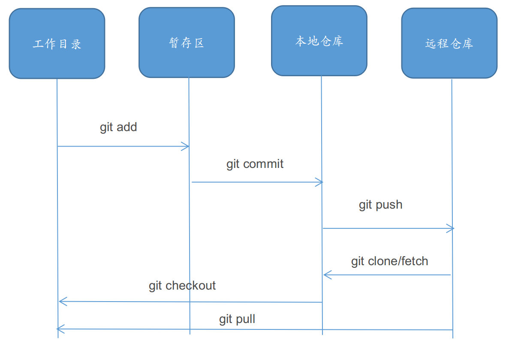

## github的配置
- github账户申请等自不必多说
- 配置github

```shell
# 用户名
git config --global user.name "your name"
# 邮箱
git config --global user.email "your email"
# 设置记住密码
git config --global credential.helper store
```
- 另一种设置记住密码的方式(可选)

```shell
# 这种方式主要是利用一对密钥对进行认证
# 生成密钥对，一路回车
ssh-keygen -t rsa
# 查看公钥
vim ~/.ssh/id_rsa.pub 或 vi ~/.ssh/id_rsa.pub
# 复制终端显示的公钥，然后:q退出
# 将刚刚复制的公钥添加到github setting->SSH and GPG keys->New SSH key
```
## git概述及常用命令介绍

### 新建git仓库

```shell
# 第一种 现在本来init了一个仓库然后和远程仓库进行连接并拉取文件下来
mkdir dirname
git init
# git remote add <主机名> <网址>
git remote add origin https://github.com/S-Lab-IIE-CAS/document.git
# git pull <远程主机名> <远程分支名>:<本地分支名> 尽量保持远程分支名和本地分支名一致
git pull origin master:master
# 第二种 直接clone
git clone https://github.com/S-Lab-IIE-CAS/document.git
```
### 更改文件并提交


```shell
# 比如你新加了一个readme.txt文件
# 首先把你要提交的改动add到暂存区
git add readme.txt
# 可以同时add多个文件
git add readme.txt readme2.txt
# 将当前目录说有文件add进暂存区
git add .
# 然后将暂存区的文件提交到本地仓库
git commit -m “本地提交的log”
# 讲本地仓库的改动push到远程仓库
# git push <远程主机名> <本地分支名>:<远程分支名>
git push origin master:master
```
**只有被add进暂存区的文件，commit时才会被提交到本地仓库，如果没有add，即使该本文件发生了改变了，commit时也会被忽略**
### 状态查看

```shell
# 查看文件状态，可以看到哪些文件发生了改变
git status
# 可以看到从每一个commit的log
git log
```
### 分支管理

```shell
# 查看当前分支
git branch
# 以当前分支为基础新建分支并切换过去
git branch newbranch
git checkout newbranch
# 以branch1为基础新建分支并切换过去
git checkout -b branch2_based_on_b1 branch1
# 删除本地分支
git branch -D somebranch
# 删除远程分支 或者git push origin --delete somebranch
git push origin  :somebranch

```

### 分支使用示例

一般开发至少两个分支: master和dev，master一般是稳定版，在实际运行，而dev是处于开发状态

1. **新建分支dev                                  
**

2. **在dev上进行开发，每一个圆圈代表一次commit，每一个commit都是一个节点，用于记录和回滚**

3. **开发分支代码已稳定，然后将代码merge到master，然后重复以上步骤**


### 回滚操作

- 撤销add

```shell
# 新建test1.txt test2.txt test3.txt
echo "hello world">test1.txt>test2.txt>test3.txt
# add test1.txt test2.txt test3.txt
git add test1.txt test2.txt test3.txt
# 查看状态，已添加到暂存区
git status
# 发现不想commit test1.txt和test2.txt，只想commit test3.txt，需要撤销刚刚add了的test1.txt和test2.txt
git reset HEAD test1.txt test2.txt
```

- 撤销commit

```shell
# 修改了一堆代码，发现搞得乱七八糟，想清空暂存区，回到上一次commit的状态
git reset --hard HEAD #相当于HEAD^0
# 然后继续修改代码，并提交到了本地仓库
git commit -m "我修改了代码"
# 这时我发现代码弄错了好多，想要撤回commit(或者你就一次次ctrl+z然后再commit抵消回去了)
git reset --hard HEAD^i # i为撤销几次操作
# 但是你想回到一周前的commit你的本地保留的没有那么多ctrl+z了
# 查看commit的log
git log
#找到你想回到的commit hash值: 324d22100aeed37292cecdc0df955c1d08ddd70a
git reset --soft 324d22100aeed37292cecdc0df955c1d08ddd70a
# 几种reset模式简介
#git reset --mixed：此为默认方式，不带任何参数的git reset，即时这种方式，它回退到某个版本，只保留源码，回退commit和暂存区信息
#git reset --soft：回退到某个版本，只回退了commit的信息，暂存区和工作目录不会发生变化。如果还要提交，直接commit即可
#Git reset  --hard：彻底回退到某个版本，工作目录、暂存区和commit都会回退，所以本地的源码也会变为上一个版本的内容，此命令慎用！
#具体参考http://blog.csdn.net/caomiao2006/article/details/40265027
```
